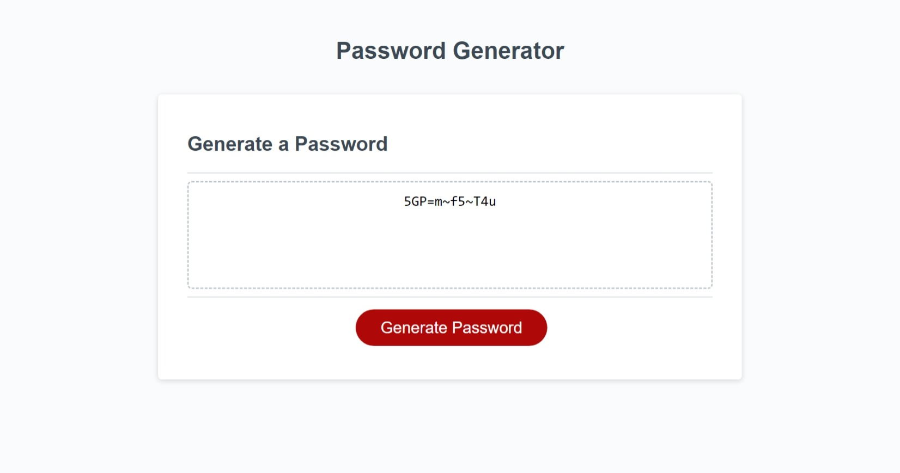

# Password Generator

## Description

Generates a safe and secure password based off a set of criteria requested by the user. Each required criterion is pompted to the user on the browser window. The user inputs are checked for their validity and display error messages if the inputs are invalid. The user inputs are used to filter the generated password to follow the requirements that were selected. 

During the project, Abdelrahman learnt how to use arrow function shorthand, spread syntax (...) to expand an iterable object, forEach loop shorthand, and pointing to functions to be repeatedly invoked and provide different results. Abdelrahman also gained the valuable skill of making functions to prevent writing repeated code, as well as understanding how to structure data to apply specific properties that alter the data as required.

## Installation
N/A

## Usage

The link to the website can be found here: https://abdelrahmanahmed605.github.io/password-generator/ . A screenshot of the webpage can be found below.

To use the password generator website, you can click the "generate password" button which will generate a variety of prompts to be displayed on the browser for the user to apply their input. When the input is invalid, error messages will pop up on the browser. When the input is valid and a password is generated, it will appear in the box at the center of the screen.

## Credits

Abdelrahman Ahmed https://github.com/AbdelrahmanAhmed605

University of Toronto, BootCampSpot https://courses.bootcampspot.com/courses/2861/assignments/46285?return_to=https%3A%2F%2Fcourses.bootcampspot.com%2Fcalendar%23view_name%3Dmonth%26view_start%3D2023-01-12

Stack Overflow https://stackoverflow.com/questions/2450954/how-to-randomize-shuffle-a-javascript-array

## License

Please refer to the MIT LICENSE in the repo.
